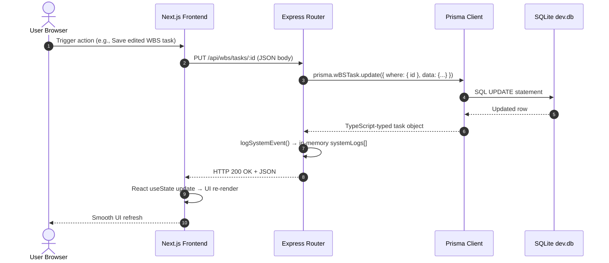

# Architecture

> Generated by /map on 2026-07-23
> Last Updated: 2026-07-24 (v3 — Order Management removed; Excel-schema Inventory added; WBS as single source of truth)
> Sources: `ARCHITECTURE_AND_DATA_FLOW.md` · `CODEBASE_GUIDE.md` · `Skytech_Store_Inventory_Management.xlsx`

---

## Overview

**SkyTech Program Management System (SPMS)** is an enterprise-grade, full-stack TypeScript web application built exclusively for **Skytech Switchgear Pvt. Ltd.** It digitises the complete switchgear manufacturing lifecycle — from the moment a client inquiry is received, through design, mechanical fabrication, assembly, electrical wiring, testing, dispatch, accounts, and after-sales support.

The system is architecturally decoupled into two independently deployable applications:

- **Backend** — Express.js REST API (TypeScript) with Prisma ORM, currently using SQLite locally and targeting PostgreSQL on AWS EC2 in production.
- **Frontend** — Next.js 16 App Router (React 19, TypeScript) styled with Tailwind CSS v4.

Communication between the two applications is exclusively via HTTP/JSON REST calls. There is no shared runtime, no Server Actions, and no monorepo package linking — both applications are independently deployable.

---

## System Diagram

```
┌──────────────────────────────────────────────────────────────────────────┐
│                          Browser (End User)                              │
│                                                                          │
│   ┌──────────────────────────────────────────────────────────────────┐   │
│   │              Next.js 16 Frontend  (Port 3000)                    │   │
│   │                                                                  │   │
│   │  layout.tsx → anti-flicker <script> → DashboardLayout.tsx       │   │
│   │  (sidebar + topbar + health badge + user profile popover)        │   │
│   │                                                                  │   │
│   │  App Router Pages:                                               │   │
│   │   /                    → Dashboard Cockpit     (~1,022 lines)   │   │
│   │   /inquiries           → Inquiry Management    (~840 lines)     │   │
│   │   /wbs                 → Work Breakdown Struct (~1,283 lines)   │   │
│   │   /employees           → Employee Directory    (~435 lines)     │   │
│   │   /inventory           → Inventory Management  (Phase 4)        │   │
│   │   /employee-management → Employee Hub ERP      (~2,174 lines)  │   │
│   │   /architecture        → redirects to /                         │   │
│   └───────────────────────────┬──────────────────────────────────────┘   │
│                               │  HTTP fetch() — hardcoded               │
│                               │  http://localhost:5000                  │
└───────────────────────────────┼──────────────────────────────────────────┘
                                │
┌───────────────────────────────▼──────────────────────────────────────────┐
│                  Express.js Backend API  (Port 5000)                     │
│                                                                          │
│   server.ts → cors() + express.json() → Route Modules                   │
│                                                                          │
│   /api/inquiries            inquiries.ts           (Prisma → SQLite)    │
│   /api/wbs                  wbs.ts                 (Prisma → SQLite)    │
│   /api/employees            employees.ts           (Prisma → SQLite)    │
│   /api/inventory            inventory.ts           (Prisma → SQLite)    │
│   /api/employee-management  employeeManagement.ts  (mockData — Mock)   │
│   /api/system               system.ts              (Simulated Metrics)  │
│   /health                   inline healthcheck                          │
│                                                                          │
│   ┌────────────────────────┐     ┌──────────────────────────────────┐   │
│   │  src/data/mockData.ts  │     │  src/db/prisma.ts                │   │
│   │  (~40 KB in-memory     │     │  (PrismaClient singleton)        │   │
│   │   volatile store)      │     └────────────────┬─────────────────┘   │
│   └────────────────────────┘                      │                     │
└───────────────────────────────────────────────────┼─────────────────────┘
                                                    │
                                     ┌──────────────▼─────────────────┐
                                     │   SQLite  (Backend/prisma/     │
                                     │   dev.db) via Prisma ORM       │
                                     │                                │
                                     │   Inquiry / WBSPhase / WBSTask │
                                     │   Employee / Attendance        │
                                     │   Job / StockItem              │
                                     │   StockReceipt / StockIssue    │
                                     └────────────────────────────────┘
```

---

## Components

### Frontend — Root Layout & Shell

- **Purpose:** Persistent application chrome — sidebar navigation, topbar, backend health indicator, user profile dropdown, and anti-flicker initialisation.
- **Location:** `Frontend/src/app/layout.tsx`, `Frontend/src/components/DashboardLayout.tsx`
- **Dependencies:** `next/link`, `next/navigation`, `lucide-react`
- **Key behaviours:**
  - Sidebar open/closed state persisted in `localStorage` under key `skytech_sidebar_open`
  - Anti-flicker: inline `<script>` in `<head>` reads `localStorage` and adds `sidebar-collapsed` class to `<html>` before first paint; matching CSS in `globals.css` collapses the sidebar margin immediately.
  - `DashboardLayout` delays enabling CSS transitions until after mount (`mounted` state flag) to prevent animation on initial render.
  - Backend health polled every 10 s via `GET /health` → green/red "Online / Offline" badge in topbar.
  - Hardcoded user profile (name: Vinayak NPN, role: Administrator) — no real auth yet.
  - **Employee Hub bypass:** If `pathname?.startsWith('/employee-management')` → render `{children}` directly without sidebar/header shell (fullscreen ERP mode).

---

### Frontend — Dashboard Cockpit (`/`)

- **Purpose:** Primary operational command centre. KPI overview, production phase pipeline, department checklists, system architecture monitor, and log stream.
- **Location:** `Frontend/src/app/page.tsx` (~1,022 lines)
- **API Calls:**
  - `GET /api/inquiries/stats` — Inquiry pipeline summary bar
  - `GET /api/inquiries/confirmed` — Project selector dropdown (confirmed, non-hold projects)
  - `GET /api/wbs/stats?inquiryId=X` — **KPI data (replaces orders mock)**
  - `GET /api/wbs/phases?inquiryId=X` — **Production phase pipeline (replaces orders mock)**
  - `GET /api/wbs?inquiryId=X` — **Department checklist (replaces orders mock)**
  - `GET /api/system/status` — Live system component metrics & log stream
- **Key Features:**
  - Interactive date picker with day navigation
  - Commercial Inquiry Pipeline Summary Bar (Total, Offers Sent, Confirmed, Win Rate %)
  - Project selector dropdown — filter all dashboard data by confirmed project
  - 4 KPI Stat Cards (Overall Completion %, Active Tasks, Staff Attendance %, Active Phase)
  - 7-node Production Phase Pipeline with auto-advancement engine
  - Phase Auto-Advancement: when all checklist tasks for a department are complete, focus automatically shifts to the next stage
  - Per-department checklist checkboxes and free-text remark boxes
  - Inline `CircularProgress` (SVG ring) and `MiniBarChart` components

> **v3 note:** All production/checklist data comes from `/api/wbs` — NOT from `/api/orders`. Order Management was removed.

---

### Frontend — Inquiry Management (`/inquiries`)

- **Purpose:** Commercial CRM — manage client inquiries, track statuses, and view funnel conversion metrics.
- **Location:** `Frontend/src/app/inquiries/page.tsx` (~840 lines)
- **API Calls:** Full CRUD on `/api/inquiries` + `GET /api/inquiries/stats`
- **Key Features:**
  - Stats summary row (Total, Confirmed, Unconfirmed, Offers Sent, Win Rate)
  - Searchable + filterable table (ALL / Confirmed / Offer Sent / Inquiry Received / Unconfirmed)
  - `+ Add Inquiry` modal → `POST /api/inquiries`
  - Edit modal → `PUT /api/inquiries/:id`
  - Delete confirmation modal → `DELETE /api/inquiries/:id`
  - Colour-coded status badges

---

### Frontend — Work Breakdown Structure (`/wbs`)

- **Purpose:** Engineering project execution tracking — hierarchical 9-phase WBS tree with full task management.
- **Location:** `Frontend/src/app/wbs/page.tsx` (~1,283 lines — second-largest page)
- **API Calls:** `GET /api/wbs`, `GET /api/inquiries`, `POST /api/wbs/tasks`, `PUT /api/wbs/tasks/:id`, `DELETE /api/wbs/tasks/:id`
- **Key Features:**
  - Confirmed Project Selector dropdown (filters by confirmed inquiry status)
  - Phase accordion rows with nested tasks: WBS Code, Task Name, Owner, Plan/Actual Hours, Status, Progress %
  - Add Task modal → `POST /api/wbs/tasks`
  - Edit Task modal → `PUT /api/wbs/tasks/:id`
  - Delete Task confirmation → `DELETE /api/wbs/tasks/:id`

---

### Frontend — Employee Directory (`/employees`)

- **Purpose:** Staff management — list all personnel, register new accounts, update status.
- **Location:** `Frontend/src/app/employees/page.tsx` (~435 lines)
- **API Calls:** `GET /api/employees`, `POST /api/employees`, `PUT /api/employees/:id/status`
- **Key Features:**
  - Employee card grid with department filter dropdown
  - Cards: name, initials avatar, department, designation, role badge, status indicator
  - Status toggle buttons (Active / On Leave)
  - `+ Add New Employee` modal

---

### Frontend — Employee Hub ERP (`/employee-management`)

- **Purpose:** Standalone fullscreen HR sub-application — attendance, leave, tasks, field visits, running jobs, salary slips.
- **Location:** `Frontend/src/app/employee-management/page.tsx` (~2,174 lines — largest file in codebase)
- **API Calls:** Full coverage of `/api/employee-management/*` sub-endpoints
- **Status:** Uses **in-memory mock data** — data resets on server restart.

| Tab | Features | Backend Endpoint |
|-----|----------|-----------------|
| Dashboard | HR stats, attendance summary, active tasks, running jobs | `GET /api/employee-management/dashboard` |
| Attendance | Calendar view, clock-in event | `GET/POST /api/employee-management/attendance` |
| Tasks | Task assignment, add/update status | `GET/POST/PUT /api/employee-management/tasks` |
| Visit Reports | Field visit tracking | `GET/POST/PUT/DELETE /api/employee-management/visits` |
| Leave Requests | Apply/approve/reject | `GET/POST/PUT /api/employee-management/leaves` |
| Running Jobs | Active job progress bars | `GET/PUT /api/employee-management/jobs` |
| Salary | Salary slip viewer | `GET /api/employee-management/salary` |

---

### Backend — Express Server Entry Point

- **Purpose:** Application entry point; registers global middleware and mounts all route modules.
- **Location:** `Backend/src/server.ts`
- **Port:** `process.env.PORT || 5000`
- **Middleware:** `cors()` (fully open — no origin allowlist) + `express.json()`
- **Routes Mounted:**

| Mount Path | Router File | Data Source |
|-----------|-------------|-------------|
| `/api/inquiries` | `inquiries.ts` | Prisma / SQLite ✅ |
| `/api/wbs` | `wbs.ts` | Prisma / SQLite ✅ |
| `/api/employees` | `employees.ts` | Prisma / SQLite ✅ |
| `/api/inventory` | `inventory.ts` | Prisma / SQLite ✅ (Phase 4) |
| `/api/employee-management` | `employeeManagement.ts` | mockData (volatile — Phase 5) |
| `/api/system` | `system.ts` | Simulated (Math.random) |
| `/health` | Inline handler | — |

> ❌ `/api/orders` route is **deleted**. All dashboard data now goes through `/api/wbs`.

---

### Backend — Prisma ORM Layer

- **Purpose:** Type-safe persistent database access for Inquiries, WBS (Phases + Tasks), Employees, and Attendance.
- **Location:** `Backend/src/db/prisma.ts` (singleton), `Backend/prisma/schema.prisma`
- **Database:** SQLite file at `Backend/prisma/dev.db` (dev) → PostgreSQL on AWS EC2 (prod target)
- **Singleton Pattern:** `globalForPrisma.prisma || new PrismaClient()` — prevents connection pool exhaustion on hot-reload.

---

### Backend — Mock Data Layer

- **Purpose:** In-memory prototype store for modules not yet migrated to Prisma persistence.
- **Location:** `Backend/src/data/mockData.ts` (~40 KB)
- **What it holds:** `mockOrders`, `mockEmployees`, `mockEmployeeAttendance`, `mockLeaveApplications`, `mockRunningJobs`, `mockSalarySlips`, `mockVisitReports`, `systemLogs`
- **Critical limitation:** All data is permanently lost on every Express server restart — by design during rapid UI prototyping.

---

### Backend — Data Models (Prisma Schema)

#### Core Models

| Model | Purpose | Key Relations |
|-------|---------|---------------|
| `Inquiry` | Client proposals and CRM lead tracking | → `WBSTask[]`, `Job[]` |
| `WBSPhase` | Top-level WBS phases (Design, Mechanical, Assembly, etc.) | → `WBSTask[]` |
| `WBSTask` | Individual tasks within WBS phases, optionally linked to Inquiries | → `WBSPhase`, `Inquiry?` |
| `Employee` | Staff directory; `microsoftId` field prepared for Microsoft OAuth SSO | → `Attendance[]` |
| `Attendance` | Clock-in / clock-out records per employee | → `Employee` |

#### Inventory Models (Excel-Aligned — Phase 4)

| Model | Excel Sheet | Purpose | Key Relations |
|-------|-------------|---------|---------------|
| `Job` | Job Master | Running jobs (= `job_id`). Auto-created when Inquiry → Confirmed | → `Inquiry?`, `StockIssue[]` |
| `StockItem` | Item Master | Master material list (= `item_id`). 18 client items seeded | → `StockReceipt[]`, `StockIssue[]` |
| `StockReceipt` | Stock IN | Inbound material receipt log | → `StockItem` (via `itemCode`) |
| `StockIssue` | Stock OUT | **R9 join table**: `job_id (jobNo) ↔ item_id (itemCode)` | → `Job` (via `jobNo`), `StockItem` (via `itemCode`) |

> `StockIssue` is the implementation of R9. `jobNo` = `job_id`. `itemCode` = `item_id`.

**Critical Status Enumerations** (stored as strings in SQLite):
- `Inquiry`: `"Inquiry Received"` | `"Offer Sent"` | `"Confirmed"` | `"Unconfirmed"`
- `WBSTask`: `"DONE"` | `"IN PROGRESS"` | `"NOT STARTED"`
- `Employee`: `"Active"` | `"On Leave"` | `"Suspended"`
- `Job`: `"Running"` | `"Completed"` | `"On Hold"`
- `StockItem`: `"Active"` | `"Inactive"`

---

## Data Flow

### A. Persistent Data Flow (Inquiries, WBS, Employees)



### B. Inventory Data Flow (Phase 4 — Prisma-backed)

```mermaid
sequenceDiagram
    autonumber
    actor Admin as Admin User
    participant FE as Next.js Frontend
    participant BE as Express Router
    participant DB as Prisma Client
    participant SQLite as SQLite dev.db

    Admin->>FE: Issue material (Stock OUT tab)
    Note over Admin,FE: Selects Job No (JOB-01) + Item Code (MCB-006)
    FE->>BE: POST /api/inventory/issues { jobNo, itemCode, qtyOut, ... }
    BE->>DB: Validate jobNo in Job table, itemCode in StockItem table
    BE->>DB: Compute currentStock; reject if qtyOut > currentStock
    DB->>SQLite: INSERT INTO StockIssue VALUES(...)
    SQLite-->>DB: StockIssue record with ISS-NNN
    DB-->>BE: Created issue
    BE-->>FE: HTTP 201 + JSON
    FE->>FE: Refresh issues list + item stock levels
```

### C. Inquiry → Job Lifecycle (Inventory Bridge)

```
Client Inquiry (INQ-xxx created)
  → Inquiry status: Inquiry Received → Offer Sent → Confirmed
  → Confirmed → Job auto-created (JOB-NN, inquiryId=INQ-xxx)
  → Job is now selectable in Stock OUT "Job No" dropdown
  → StockIssue logged against Job: jobNo (job_id) ↔ itemCode (item_id)
  → Job-wise Summary computed from StockIssue GROUP BY jobNo, itemCode
  → WBS Tasks optionally linked to Inquiry for engineering hour tracking
  → Dashboard KPIs from GET /api/wbs/stats?inquiryId=INQ-xxx
```

### D. Health Monitoring Loop

```
DashboardLayout (every 10 s)
  → GET /health → "Online" | "Offline" badge in topbar

Dashboard page (/api/system/status)
  → Randomised CPU / memory metrics per simulated component
  → Growing in-memory log buffer (systemLogs array)
```

---

## Database Relational Schema

```
Inquiry (1) ──────────────── (many) WBSTask
            inquiryId FK (onDelete: SetNull)

Inquiry (1) ──────────────── (many) Job          ← NEW Phase 4
            inquiryId FK (onDelete: SetNull)

WBSPhase (1) ─────────────── (many) WBSTask
             phaseId FK (onDelete: Cascade)

Job (1) ────────────────────  (many) StockIssue  ← R9 join table
        jobNo FK                                  ← jobNo = job_id

StockItem (1) ──────────────  (many) StockIssue  ← R9 join table
              itemCode FK                         ← itemCode = item_id

StockItem (1) ──────────────  (many) StockReceipt
              itemCode FK

Employee (1) ───────────────  (many) Attendance
             employeeId FK (onDelete: Cascade)
```

**Cascade behaviours:**
- Deleting a `WBSPhase` → automatically deletes all child `WBSTask` records
- Deleting an `Employee` → automatically deletes all `Attendance` records
- Deleting an `Inquiry` → sets `WBSTask.inquiryId = NULL` + sets `Job.inquiryId = NULL` (preserves both, unlinks from project)
- Deleting a `Job` → blocked if `StockIssue` records exist (inventory integrity)
- Deleting a `StockItem` → blocked if `StockIssue` or `StockReceipt` records exist

---

## Data Persistence Matrix

| Module / Feature | Frontend Page | Backend Route | Persistence | Resets on Restart? |
|------------------|---------------|---------------|-------------|-------------------|
| Client Inquiries | `/inquiries` | `routes/inquiries.ts` | SQLite via Prisma | ❌ No |
| Inquiry Stats | `/` dashboard | `routes/inquiries.ts` | SQLite via Prisma | ❌ No |
| WBS Phases & Tasks | `/wbs` | `routes/wbs.ts` | SQLite via Prisma | ❌ No |
| Dashboard KPIs & Pipeline | `/` dashboard | `routes/wbs.ts` (/stats, /phases) | SQLite via Prisma | ❌ No |
| Employee Directory | `/employees` | `routes/employees.ts` | SQLite via Prisma | ❌ No |
| Jobs (Job Master) | `/inventory` | `routes/inventory.ts` | SQLite via Prisma (Phase 4) | ❌ No |
| Item Master (18 items) | `/inventory` | `routes/inventory.ts` | SQLite via Prisma (Phase 4) | ❌ No |
| Stock IN (Receipts) | `/inventory` | `routes/inventory.ts` | SQLite via Prisma (Phase 4) | ❌ No |
| Stock OUT / Issues (R9) | `/inventory` | `routes/inventory.ts` | SQLite via Prisma (Phase 4) | ❌ No |
| Attendance Logs | `/employee-management` | `routes/employeeManagement.ts` | In-Memory Mock (Phase 5) | ✅ Yes |
| Leave Applications | `/employee-management` | `routes/employeeManagement.ts` | In-Memory Mock (Phase 5) | ✅ Yes |
| Visit Reports | `/employee-management` | `routes/employeeManagement.ts` | In-Memory Mock (Phase 5) | ✅ Yes |
| Running Jobs | `/employee-management` | `routes/employeeManagement.ts` | In-Memory Mock (Phase 5) | ✅ Yes |
| Salary Slips | `/employee-management` | `routes/employeeManagement.ts` | In-Memory Mock (Phase 5) | ✅ Yes |
| System Event Logs | Dashboard monitor | `routes/system.ts` | In-Memory Stack | ✅ Yes |
| Sidebar State | All pages | `DashboardLayout.tsx` | localStorage | ❌ No |
| ~~Manufacturing Orders~~ | ~~`/orders`~~ | ~~`routes/orders.ts`~~ | **DELETED** | — |

---

## API Reference Summary

| Method | Endpoint | Persistence | Description |
|--------|----------|-------------|-------------|
| `GET` | `/health` | — | Backend liveness check |
| `GET` | `/api/inquiries` | **DB** | All client inquiries |
| `GET` | `/api/inquiries/stats` | **DB** | Conversion funnel metrics |
| `GET` | `/api/inquiries/confirmed` | **DB** | Confirmed non-hold inquiries (for project dropdown) |
| `POST` | `/api/inquiries` | **DB** | Create new inquiry |
| `PUT` | `/api/inquiries/:id` | **DB** | Partial update; auto-creates Job when status→Confirmed |
| `DELETE` | `/api/inquiries/:id` | **DB** | Delete inquiry |
| `GET` | `/api/wbs` | **DB** | Full WBS phase + task tree |
| `GET` | `/api/wbs/stats` | **DB** | KPI metrics (replaces dashboard orders mock) |
| `GET` | `/api/wbs/phases` | **DB** | Phase pipeline data (replaces dashboard orders mock) |
| `POST` | `/api/wbs/tasks` | **DB** | Add WBS task |
| `PUT` | `/api/wbs/tasks/:id` | **DB** | Update WBS task |
| `DELETE` | `/api/wbs/tasks/:id` | **DB** | Delete WBS task |
| `GET` | `/api/employees` | **DB** | All employees |
| `POST` | `/api/employees` | **DB** | Register new employee |
| `PUT` | `/api/employees/:id/status` | **DB** | Update employee status |
| `GET` | `/api/inventory/jobs` | **DB** (Phase 4) | All jobs (Job Master) |
| `POST` | `/api/inventory/jobs` | **DB** (Phase 4) | Create job (auto-gen JOB-NN) |
| `PUT` | `/api/inventory/jobs/:jobNo` | **DB** (Phase 4) | Update job |
| `GET` | `/api/inventory/items` | **DB** (Phase 4) | All items with computed fields |
| `GET` | `/api/inventory/items/low-stock` | **DB** (Phase 4) | Items below reorder level |
| `POST` | `/api/inventory/items` | **DB** (Phase 4) | Create item |
| `PUT` | `/api/inventory/items/:itemCode` | **DB** (Phase 4) | Update item |
| `GET` | `/api/inventory/receipts` | **DB** (Phase 4) | All stock receipts (Stock IN) |
| `POST` | `/api/inventory/receipts` | **DB** (Phase 4) | Log receipt (auto-gen GRN-NNN) |
| `GET` | `/api/inventory/issues` | **DB** (Phase 4) | All stock issues (Stock OUT) — R9 |
| `POST` | `/api/inventory/issues` | **DB** (Phase 4) | Log issue (job_id × item_id) (auto-gen ISS-NNN) |
| `GET` | `/api/inventory/summary/job-wise` | **DB** (Phase 4) | Cross-tab: items × jobs |
| `GET` | `/api/inventory/dashboard` | **DB** (Phase 4) | Inventory KPI snapshot |
| `GET` | `/api/employee-management/dashboard` | Mock | HR dashboard summary |
| `GET/POST` | `/api/employee-management/attendance` | Mock | Attendance logs |
| `GET/POST/PUT` | `/api/employee-management/tasks` | Mock → DB (Phase 5) | Employee WBS task assignments |
| `GET/POST/PUT/DELETE` | `/api/employee-management/visits` | Mock | Visit reports |
| `GET/POST` | `/api/employee-management/leaves` | Mock | Leave applications |
| `PUT` | `/api/employee-management/leaves/:id/status` | Mock | Approve/Reject leave |
| `GET` | `/api/system/status` | Simulated | System component metrics & logs |

---

## Integration Points

| External Service | Type | Status | Purpose |
|-----------------|------|--------|---------|
| Microsoft Entra ID / Graph API | OAuth / REST | **Simulated** (DB schema ready) | Employee SSO — `microsoftId` field in `Employee` model |
| Email SMTP | Service | **Simulated** | Leave approval notification emails |
| WhatsApp / SMS Gateway | API | **Simulated** | Real-time alert notifications |
| Razorpay | Payment Gateway | **Simulated** | Payment processing |
| Google Maps Location API | REST | **Simulated** | Site visit / field engineer location tracking |
| Azure Blob Storage | Object Storage | **Simulated** | CAD drawings and document file uploads |
| PostgreSQL / Neon | Database | **Planned** (currently SQLite) | Production database |
| AWS EC2 | Compute | **Planned** | Backend hosting |

> All integrations appear as "Online" in the architecture monitor but **no actual external API calls are made** — they are simulation artefacts in `system.ts`.

---

## Architecture & Design Decisions

### 1. Decoupled Full-Stack Architecture (Separate Next.js + Express)
- **Decision:** Run Next.js (port 3000) and Express.js (port 5000) as fully independent processes communicating via HTTP REST.
- **Why:** The Express server can be hosted on AWS EC2, Docker, or PM2 without any Vercel dependency. Each service scales independently. Backend routes are testable with Postman or `curl` without a browser.
- **Rejected alternative:** Next.js Server Actions / `app/api` routes — tightly coupled to Vercel's serverless model with 10–60 s cold-start timeouts; hard to test in isolation.

### 2. SQLite for Development with Prisma ORM Abstraction
- **Decision:** Use SQLite locally (`dev.db`) with all DB interactions through Prisma.
- **Why:** Zero-config onboarding — `npm install && npx prisma db push` gives a working database instantly. Switching to PostgreSQL is a single-line change in `schema.prisma` + `DATABASE_URL`.
- **Rejected alternative:** Hard-wiring PostgreSQL locally forces every developer to install and configure a database server.

### 3. Hybrid Persistence Strategy (DB vs. In-Memory Mocks)
- **Decision:** Inquiries, WBS, Employees → Prisma/SQLite (persistent). Orders, Inventory, Employee Hub → `mockData.ts` (volatile in-memory).
- **Why:** Enables rapid UI prototyping without premature schema commitment. The three DB-backed modules prove the relational model is sound. Bugs in mock layer cannot corrupt the database.
- **Migration path:** Route handlers simply swap `mockData.ts` helpers for `prisma.order.*` calls when ready. Schema models are already defined.

### 4. Anti-Flicker Sidebar State Persistence
- **Decision:** Sidebar state persisted in `localStorage`. Inline blocking `<script>` in `<head>` reads value and applies `sidebar-collapsed` to `<html>` before first paint; matched by CSS in `globals.css`.
- **Why:** `useEffect` runs after first paint → visible flash. Server-side cookies → routing latency. The inline script executes synchronously before DOM is painted, eliminating layout shifts.

### 5. Employee Hub Layout Bypass
- **Decision:** `DashboardLayout.tsx` detects `/employee-management` path and renders `{children}` without sidebar or header.
- **Why:** The Employee Hub contains dense multi-column tables (attendance logs, salary slips) that need maximum horizontal viewport. The sidebar steals 240px of critical space.

### 6. Single-File Page Architecture
- **Decision:** Each major page (WBS at 1,283 lines, Employee Hub at 2,174 lines) is one TypeScript file with all inline modals, forms, and state.
- **Why:** All sub-modal forms, tables, and loading states share one React tree — simple direct `useState`/`useEffect` without prop drilling or global state stores. When requirements stabilize, components will be extracted into `/components/` subdirectories.

### 7. `lucide-react` as the Sole Icon Library
- **Decision:** All icons exclusively use `lucide-react`.
- **Why:** Visual consistency (same stroke width, corner radius), tree-shakeable, TypeScript-native. Single library eliminates icon-style conflicts.

---

## Conventions

### Naming
- TypeScript source files: `camelCase.ts` (routes/utilities), `PascalCase.tsx` (React components)
- API route paths: `kebab-case` (e.g., `/employee-management`)
- Database IDs: UUID v4 via Prisma `@default(uuid())`
- Generated codes: `EMP-0N`, `INQ-1NN` (count-based — collision-prone after deletes)

### File & Directory Structure
- **Frontend:** One page file per route: `src/app/<route>/page.tsx`
- **Backend:** One route module per feature domain: `src/routes/<feature>.ts`
- **No shared type package** between Frontend and Backend — types duplicated or inferred separately

### Error Handling
- Backend (Prisma routes): `try/catch` + `console.error` + HTTP 404/500
- Backend (mockData routes): No try/catch (synchronous arrays, no failure modes)
- Frontend: Some `fetch().catch(() => null)` patterns; no global React error boundary
- No validation middleware (Zod, express-validator) on any route

### State Management
- All client state via React `useState` / `useEffect`
- No external state library (Redux, Zustand, Jotai)
- No API client library (Axios, React Query, SWR) — raw `fetch()` on every page mount

### Testing
- **Zero test files exist** — no test runner configured in either `package.json`

---

## Technical Debt

- [ ] **Hardcoded API URL** — All ~35 `fetch()` calls hardcode `http://localhost:5000`; must become `NEXT_PUBLIC_API_URL` env var before any non-local deployment (`Frontend/src/app/**`, `DashboardLayout.tsx`)
- [ ] **Mock data not persisted** — Attendance, leave, visits, running jobs, salary — all in-memory; server restart wipes everything (Phase 5 migration)
- [x] **Order Management removed** — ~~`/api/orders` and mockOrders are fully deleted~~; dashboard now uses `/api/wbs`
- [ ] **Inventory not yet Prisma-backed** — `inventory.ts` still uses mock; Phase 4 migrates to `Job`, `StockItem`, `StockReceipt`, `StockIssue` models
- [ ] **No authentication or authorisation** — No login flow, no session, no JWT/RBAC; user profile hardcoded to "Vinayak NPN / Administrator" (Phase 3)
- [ ] **No shared type definitions** — Frontend and Backend share no type contracts; API shape changes require manual synchronisation on both sides
- [ ] **No validation middleware** — No request body validation or sanitisation on any route (no Zod, no express-validator) (Phase 2)
- [ ] **No React error boundaries** — Unhandled fetch errors can cause silent UI failures (Phase 2)
- [ ] **CORS fully open** — `app.use(cors())` with no `origin` allowlist (Phase 2)
- [ ] **Massive monolithic page files** — `employee-management/page.tsx` (~2,174 lines) and `wbs/page.tsx` (~1,283 lines) need decomposition into sub-components (Phase 2)
- [ ] **Collision-prone auto-increment codes** — `INQ-${101 + count}` and `EMP-0${count + 1}` generate duplicate codes after any record deletion (Phase 2)
- [ ] **SQLite in dev, PostgreSQL planned for prod** — Provider switch and migration not yet executed (Phase 9)
- [ ] **No tests** — No unit, integration, or e2e test suite exists (Phase 10)
- [ ] **`console.error` / `console.log` in production routes** — No structured logging (no Winston/Pino) (Phase 2)
- [ ] **`/architecture` route is a dead stub** — Immediately calls `redirect('/')` with no content
