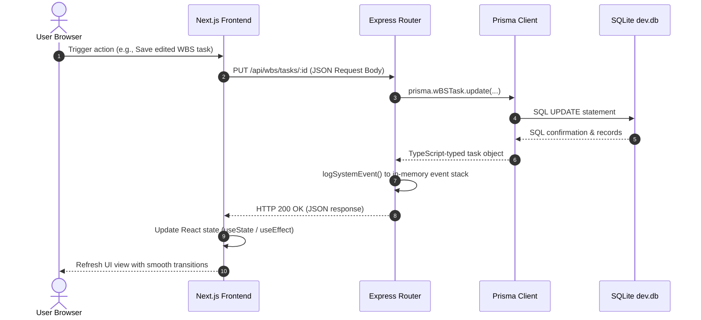
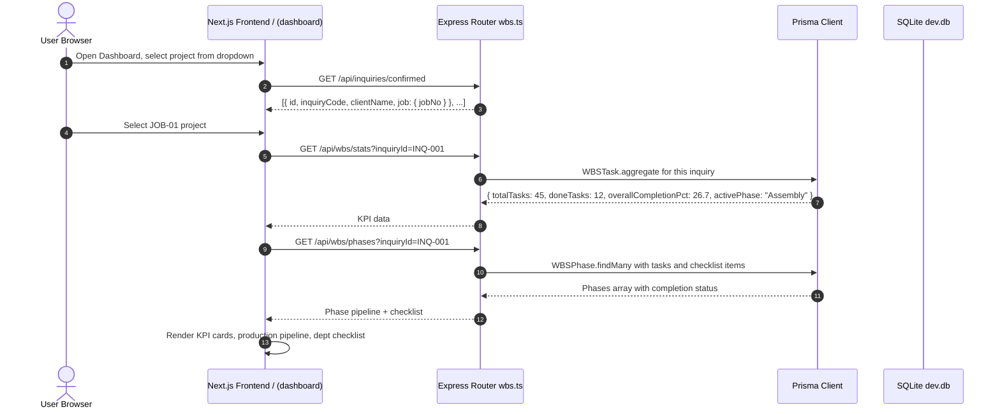

# SkyTech SPMS — Codebase Architecture, File Manifest & Design Decisions

This document provides a comprehensive analysis of the **SkyTech Program Management System (SPMS)** codebase. It outlines the work and relevance of each file, details the relationships and data flow between components, and explains the rationale behind the architectural decisions taken to date.

> **Last Updated:** 2026-07-24 (v3) — Order Management removed; Inventory migrated to Prisma; WBS is single source of truth for dashboard; Excel workbook schema (Job, StockItem, StockReceipt, StockIssue) documented.

---

## 1. System Directory & File Manifest

The SPMS workspace is structured into two main applications: the **Next.js Frontend** and the **Express Backend**, supported by database configuration and project documentation.

```text
skytech-main/
├── Backend/                 # Express API Server (Node.js & TypeScript)
├── Frontend/                # Next.js 15 Web Application (React 19 & TailwindCSS)
├── Documents/               # Specifications, Progress Reports, and Architecture Guides
└── GSD/                     # Developer environment metadata & templates
```

### A. Core Documents (`/Documents`)
These files contain the business rules, progress tracking, and initial specifications.

| File Path | Purpose | System Relevance |
| :--- | :--- | :--- |
| [`README.md`](file:///d:/Codes/Free%20Lancing/skytech-main/Documents/README.md) | Business scope and system blueprint. | Details the manufacturing workflow phases (from Inquiry to Support), the core module list, and the targeted production environment. |
| [`TECHNICAL_SPECIFICATIONS.md`](file:///d:/Codes/Free%20Lancing/skytech-main/Documents/TECHNICAL_SPECIFICATIONS.md) | High-level system architecture, database schema, and deployment guides. | Outlines the relational model structures, Microsoft OAuth SSO integration plans, and AWS EC2 migration instructions. |
| [`PROJECT_PROGRESS.md`](file:///d:/Codes/Free%20Lancing/skytech-main/Documents/PROJECT_PROGRESS.md) | Living progress tracker and verification checklist. | Documents which features are completed and persist to the database versus what remains on the upcoming roadmap. |

---

### B. Backend Service (`/Backend`)
The backend is a Node.js Express server written in TypeScript, using Prisma ORM to connect to a relational database.

#### Root Configuration Files
*   [`package.json`](file:///d:/Codes/Free%20Lancing/skytech-main/Backend/package.json): Defines dependencies (`express`, `@prisma/client`, `cors`, `dotenv`) and build scripts (`dev` using nodemon, `build` using tsc).
*   [`tsconfig.json`](file:///d:/Codes/Free%20Lancing/skytech-main/Backend/tsconfig.json): Configures the TypeScript compiler settings (target, module resolution, output directory `dist`).
*   [`.env`](file:///d:/Codes/Free%20Lancing/skytech-main/Backend/.env): Environment variables containing the database URL (`file:./dev.db`) and target port (`5000`).

#### Prisma Database Configurations (`/Backend/prisma`)
*   [`schema.prisma`](file:///d:/Codes/Free%20Lancing/skytech/Backend/prisma/schema.prisma): The source of truth for the database layout. Defines the SQLite provider and lists models: `Inquiry`, `WBSPhase`, `WBSTask`, `Employee`, `Attendance`, **`Job`**, **`StockItem`**, **`StockReceipt`**, **`StockIssue`** (Phase 4 — added to match client Excel workbook).
*   [`seed.ts`](file:///d:/Codes/Free%20Lancing/skytech/Backend/prisma/seed.ts): Seeding script that populates the database with initial mock client inquiries, employees, and 9-phase WBS tasks for local testing. Phase 4 seed adds 18 StockItems from the client's Item Master and 5 Jobs (JOB-01 to JOB-05).
*   `dev.db` *(SQLite Database binary)*: Local SQLite database file generated by Prisma migrations.

#### Express Core Logic (`/Backend/src`)
*   [`server.ts`](file:///d:/Codes/Free%20Lancing/skytech-main/Backend/src/server.ts): Express server entry point. Sets up CORS, JSON parsing middleware, routes, health checks (`/health`), and binds to port 5000.
*   [`db/prisma.ts`](file:///d:/Codes/Free%20Lancing/skytech-main/Backend/src/db/prisma.ts): Instantiates and exports a singleton instance of the `PrismaClient` to prevent exhausting database connection pools during hot-reloads in development.
*   [`data/mockData.ts`](file:///d:/Codes/Free%20Lancing/skytech-main/Backend/src/data/mockData.ts): Contains TS interfaces, memory-based mock lists for prototype endpoints (e.g. `mockOrders`, `mockLeaveApplications`), helper utility functions, and a `logSystemEvent` utility that logs server events to an in-memory stack.

#### API Endpoints (`/Backend/src/routes`)
Each router encapsulates specific domain REST endpoints:

*   [`inquiries.ts`](file:///d:/Codes/Free%20Lancing/skytech/Backend/src/routes/inquiries.ts): **[PERSISTENT]** Fully connected to Prisma. Handles CRUD operations for client inquiries and calculates conversion funnel statistics. In v3: auto-creates a `Job` record when status changes to `'Confirmed'`.
*   [`wbs.ts`](file:///d:/Codes/Free%20Lancing/skytech/Backend/src/routes/wbs.ts): **[PERSISTENT]** Connected to Prisma. Manages the 9-phase Work Breakdown Structure tree. In v3: adds `GET /api/wbs/stats` and `GET /api/wbs/phases` endpoints used by the dashboard (replacing the deleted orders mock).
*   [`employees.ts`](file:///d:/Codes/Free%20Lancing/skytech/Backend/src/routes/employees.ts): **[PERSISTENT]** Connected to Prisma. Manages the employee list and role status updates.
*   [`inventory.ts`](file:///d:/Codes/Free%20Lancing/skytech/Backend/src/routes/inventory.ts): **[PERSISTENT — Phase 4]** Migrated from mock to Prisma. Manages `Job`, `StockItem`, `StockReceipt`, and `StockIssue` models. Implements the R9 relationship: `job_id (jobNo) ↔ item_id (itemCode)` via `StockIssue`.
*   ~~[`orders.ts`]~~ **[DELETED in v3]** Formerly handled manufacturing orders in memory. Removed entirely. Dashboard data now comes from `wbs.ts`.
*   [`employeeManagement.ts`](file:///d:/Codes/Free%20Lancing/skytech/Backend/src/routes/employeeManagement.ts): **[MOCK — Phase 5]** Handles attendance logs, check-ins, tasks, visit reports, leave requests, and salary slips in memory.
*   [`system.ts`](file:///d:/Codes/Free%20Lancing/skytech/Backend/src/routes/system.ts): Simulates active CPU, RAM, and latency metrics for system components, and returns in-memory diagnostic event logs.

---

### C. Frontend Web Application (`/Frontend`)
Built using Next.js 15 App Router and React 19, styled using TailwindCSS.

#### Root Configuration Files
*   [`package.json`](file:///d:/Codes/Free%20Lancing/skytech-main/Frontend/package.json): Lists dependencies including React 19, Next.js 15, TailwindCSS v4, and Lucide icons.
*   [`next.config.ts`](file:///d:/Codes/Free%20Lancing/skytech-main/Frontend/next.config.ts): Configures Next.js compilation parameters.
*   [`postcss.config.mjs`](file:///d:/Codes/Free%20Lancing/skytech-main/Frontend/postcss.config.mjs): Integrates Tailwind CSS v4 with the PostCSS processing chain.
*   [`tsconfig.json`](file:///d:/Codes/Free%20Lancing/skytech-main/Frontend/tsconfig.json): Dictates TypeScript configuration and path aliases (e.g. `@/*` targeting `./src/*`).

#### Layout & Shell Structure (`/Frontend/src`)
*   [`app/layout.tsx`](file:///d:/Codes/Free%20Lancing/skytech-main/Frontend/src/app/layout.tsx): Root layout wrapper. Implements an inline, blocking script to prevent sidebar render flicker and wraps all pages in `DashboardLayout`.
*   [`app/globals.css`](file:///d:/Codes/Free%20Lancing/skytech-main/Frontend/src/app/globals.css): Sets default theme values and declares the anti-flicker CSS utility (`html.sidebar-collapsed #main-sidebar`).
*   [`components/DashboardLayout.tsx`](file:///d:/Codes/Free%20Lancing/skytech-main/Frontend/src/components/DashboardLayout.tsx): Layout Shell. Houses the dark navy sidebar navigation, top header, connection health poller (pinging `/health` every 10 seconds), alert badges, and the profile popover.

#### Routed Page Modules (`/Frontend/src/app`)
*   [`page.tsx`](file:///d:/Codes/Free%20Lancing/skytech/Frontend/src/app/page.tsx): Main Cockpit. Features the interactive date picker, commercial inquiry pipeline summary bar, project selector dropdown, key KPI stat cards from `GET /api/wbs/stats`, and the interactive 7-phase Production overview checklist from `GET /api/wbs/phases` and `GET /api/wbs`. **All production data comes from WBS — not orders.**
*   [`inquiries/page.tsx`](file:///d:/Codes/Free%20Lancing/skytech/Frontend/src/app/inquiries/page.tsx): Standalone commercial funnel page featuring client inquiry filters, database-connected tables, and the `+ Add Inquiry` modal.
*   [`wbs/page.tsx`](file:///d:/Codes/Free%20Lancing/skytech/Frontend/src/app/wbs/page.tsx): WBS interface displaying hierarchical tree tables. Features forms to select confirmed projects, modify sub-task details, add custom entries, or delete tasks.
*   [`employees/page.tsx`](file:///d:/Codes/Free%20Lancing/skytech/Frontend/src/app/employees/page.tsx): Employee directory that lists staff cards, designations, and roles, and contains a modal to register new personnel.
*   ~~[`orders/page.tsx`]~~ **[DELETED in v3]** Formerly visualised orders, stages, priorities, timelines, and material requisitions. Removed — data now shown through WBS.
*   [`inventory/page.tsx`](file:///d:/Codes/Free%20Lancing/skytech/Frontend/src/app/inventory/page.tsx): **[Phase 4]** Admin-only 5-tab Inventory module: Item Master, Stock IN, Stock OUT (R9 — job_id × item_id), Job-wise Summary cross-tab, Jobs.
*   [`employee-management/page.tsx`](file:///d:/Codes/Free%20Lancing/skytech/Frontend/src/app/employee-management/page.tsx): Standalone sub-application prototype presenting an ERP dashboard, attendance check-in, leave trackers, visit reports, and salary details.
*   [`architecture/page.tsx`](file:///d:/Codes/Free%20Lancing/skytech-main/Frontend/src/app/architecture/page.tsx): Helper page that instantly redirects users to the root cockpit (`/`).

---

## 2. System Relations & Data Flow

The flow of information depends on whether a module's endpoint is fully wired to the **Relational Database** or if it acts as a **Prototype Endpoint** utilizing the server's in-memory mock engine.

### A. Data Flow Diagrams

#### 1. Persistent Data Flow (Inquiries, WBS Tasks, Employee Records)
When a user updates a persistent module (e.g., editing a WBS task or registering an inquiry):



#### 2. Inventory Data Flow — Stock OUT / Issue (R9: job_id × item_id)

```mermaid
sequenceDiagram
    autonumber
    actor Admin as Admin User (Store)
    participant FE as Next.js Frontend /inventory
    participant BE as Express Router inventory.ts
    participant DB as Prisma Client
    participant SQLite as SQLite dev.db

    Admin->>FE: Open Stock OUT tab, select Job No + Item Code
    FE->>BE: GET /api/inventory/jobs (Running jobs dropdown)
    FE->>BE: GET /api/inventory/items (Active items dropdown)
    Admin->>FE: Fill qty, issued to, submit
    FE->>BE: POST /api/inventory/issues { jobNo: "JOB-01", itemCode: "MCB-006", qtyOut: 5, ... }
    BE->>DB: Validate jobNo in Job, itemCode in StockItem
    BE->>DB: Compute currentStock = opening + totalIn - totalOut; check >= qtyOut
    DB->>SQLite: INSERT StockIssue (ISS-NNN, JOB-01, MCB-006, qty=5)
    SQLite-->>DB: Created StockIssue row
    BE-->>FE: HTTP 201 + { issueNo: "ISS-001", ... }
    FE->>FE: Refresh issues table + item current stock
    FE-->>Admin: Updated Stock OUT list
```

#### 3. WBS Dashboard Flow (WBS as Single Source of Truth)



> ❌ The dashboard **never calls `/api/orders`**. Those routes are deleted.

### B. Core Structural Relations

1.  **Inquiry → Job (NEW in v3, R9):** When an `Inquiry` status changes to `'Confirmed'`, a `Job` is automatically created (`jobNo = JOB-NN`). `Job.inquiryId` links the Job back to the WBS project. This is the bridge between the WBS module and the Inventory module.
2.  **Job ↔ StockItem via StockIssue (R9 join):** `StockIssue` is the join table implementing R9. `StockIssue.jobNo` (= `job_id`) references `Job.jobNo`. `StockIssue.itemCode` (= `item_id`) references `StockItem.itemCode`. Every time material is issued to a job, a `StockIssue` row is created.
3.  **Inquiry and WBS Tasks:** The 9-phase Work Breakdown Structure is linked to inquiries via `inquiryId`. This ensures that confirmed client projects load their respective sub-task lists dynamically on `/wbs`. Dashboard KPIs now come from `GET /api/wbs/stats?inquiryId=X`.
4.  **WBS Phases and Tasks:** The `WBSPhase` model maintains a one-to-many relationship with `WBSTask`. Deleting a phase automatically propagates deletes to all child tasks (`onDelete: Cascade`).
5.  **Employees and Attendance:** The `Employee` model maintains a one-to-many relationship with the `Attendance` model using `employeeId`. Deleting an employee cascadingly purges their historical check-in logs.

---

## 2b. Excel Workbook as Database Blueprint

The client's Excel file `Skytech_Store_Inventory_Management.xlsx` defines the **exact schema** for the Inventory module. The 7 sheets map to the database as follows:

| Excel Sheet | DB Table / API | Type | Key Column(s) |
|-------------|---------------|------|---------------|
| **Job Master** | `Job` | Prisma model | `jobNo` PK = `job_id` (e.g. JOB-01) |
| **Item Master** | `StockItem` | Prisma model | `itemCode` PK = `item_id` (e.g. MCB-006) |
| **Stock IN** | `StockReceipt` | Prisma model | `itemCode` FK → StockItem |
| **Stock OUT (Issue)** | `StockIssue` | Prisma model — **R9 join** | `jobNo` FK (job_id) + `itemCode` FK (item_id) |
| **Job-wise Issue Summary** | `GET /api/inventory/summary/job-wise` | Computed | `GROUP BY jobNo, itemCode` from StockIssue |
| **Dashboard** | `GET /api/inventory/dashboard` | Computed | Aggregates from all 4 tables |
| **Instructions** | N/A | User documentation | — |

**The 18 actual items from the client's Item Master are seeded into the database:**

| itemCode | Description | Make | Category | Unit | Opening | Min | Rate (INR) |
|----------|------------|------|---------|------|---------|-----|----------|
| MCB-006 | MCB 06A SP C-Curve | Schneider Electric | Switchgear Parts | Nos | 20 | 5 | 180 |
| MCB-032 | MCB 32A SP C-Curve | Schneider Electric | Switchgear Parts | Nos | 20 | 5 | 180 |
| MCCB-001 | MCCB 100A TP | Siemens | Switchgear Parts | Nos | 5 | 2 | 4500 |
| CONT-001 | Contactor 32A 3-Pole | Siemens | Contactors & Relays | Nos | 10 | 3 | 1200 |
| RLY-001 | Control Relay 230V 2C/O | OMRON | Contactors & Relays | Nos | 15 | 5 | 220 |
| CBL-001 | Cable 2.5 sqmm Cu FRLS | Polycab | Cable | Mtr | 500 | 100 | 42 |
| CBL-002 | Cable 4 sqmm Cu FRLS | Polycab | Cable | Mtr | 300 | 100 | 65 |
| WIRE-001 | Control Wire 1.5 sqmm | Finolex | Wire | Mtr | 400 | 100 | 18 |
| LUG-001 | Copper Lug 4 sqmm Ring | Dowells | Lugs & Ferrules | Nos | 100 | 20 | 8 |
| LUG-002 | Bootlace Ferrule 1.5 sqmm | Dowells | Lugs & Ferrules | Nos | 500 | 100 | 2 |
| NB-001 | Hex Bolt M6x20 SS | Local/Generic | Nut Bolts & Fasteners | Nos | 500 | 100 | 3 |
| NB-002 | Nut M6 SS | Local/Generic | Nut Bolts & Fasteners | Nos | 500 | 100 | 1 |
| TB-001 | Terminal Block 4mm | Elmex | Terminal Blocks | Nos | 200 | 50 | 15 |
| PLC-001 | PLC Module Digital I/O | Siemens | PLC & Automation | Nos | 3 | 1 | 8500 |
| HMI-001 | HMI 7 inch Touch Panel | Siemens | HMI & Display | Nos | 2 | 1 | 15000 |
| BUS-001 | Copper Bus Bar 25x5mm | Local/Generic | Bus Bar | Mtr | 40 | 10 | 650 |
| GLD-001 | Glow Indicator Lamp 22mm | L&T | Indicators & Pilot Devices | Nos | 60 | 15 | 45 |
| CG-001 | Cable Gland PG-13.5 | Local/Generic | Cable Glands & Accessories | Nos | 150 | 30 | 12 |

---

## 3. Architecture & Design Decisions

Below are the primary design and implementation decisions, their underlying rationale, the alternatives considered, and their benefits.

### 1. Separation of Concerns (Decoupled Full-Stack System)
*   **Decision**: Run Next.js App Router as a standalone frontend and Express.js as a distinct backend server communicating via REST APIs.
*   **Why**: Separates layout rendering concerns from database transactions. This makes the system modular, easy to scale, and allows independent horizontal scaling in production.
*   **Alternatives**: A unified Next.js project using Server Actions or standard API routes.
*   **Why Chosen over Alternatives**: Next.js Server Actions can lead to vendor lock-in (e.g., Vercel-optimized hosting) and are harder to test in isolation. A dedicated Node.js Express server is hosting-agnostic (easily running on AWS EC2, PM2, Docker, or Kubernetes) and avoids serverless timeout constraints for heavy calculations.

### 2. SQLite for Development with Prisma ORM Abstraction
*   **Decision**: Use SQLite (`dev.db`) locally during development, while standardizing database interactions through Prisma.
*   **Why**: Minimizes onboarding friction for developers by offering a zero-config setup (no need to install, run, and maintain local PostgreSQL instances).
*   **Alternatives**: Hard-wiring PostgreSQL from day one.
*   **Why Chosen over Alternatives**: Using local PostgreSQL forces every developer to manually set up database servers, users, and schemas, which increases friction. Prisma abstracts the SQL layer; switching to production PostgreSQL is as simple as updating `DATABASE_URL` in `.env` and modifying the `provider` in `schema.prisma`.

### 3. Inventory Migrated to Prisma (WBS as Dashboard Source)
*   **Decision**: Migrate `inventory.ts` from mock to Prisma (Phase 4). Migrate dashboard data source from `orders.ts` mock to `wbs.ts` (Phase 2). Delete `orders.ts` entirely.
*   **Why**: The client's Excel workbook defines the exact schema: `Job`, `StockItem`, `StockReceipt`, `StockIssue`. The R9 requirement (job_id × item_id) is only implementable with a proper relational DB. The dashboard was showing stale mock data from orders; WBS has the real production progress.
*   **Alternatives**: Keeping mock data; building a separate dashboard aggregate API.
*   **Why Chosen over Alternatives**: The WBS module already holds all task completion data. Adding `GET /api/wbs/stats` is a cheap computation on existing data. No separate aggregate store needed. The inventory schema exactly mirrors the client's Excel file, making data migration trivial.

### 4. Anti-Flicker Sidebar State Persistence
*   **Decision**: Persist the sidebar expand/collapse state in `localStorage`. Inject an inline, blocking `<script>` in the HTML `<head>` inside `layout.tsx` to read the value and apply `sidebar-collapsed` class before Next.js mounts, coupled with an override class in `globals.css`.
*   **Why**: Prevents visual layout shifts (flicker) upon initial page loading.
*   **Alternatives**: Relying on React's `useEffect` or checking state on the server.
*   **Why Chosen over Alternatives**: `useEffect` runs only after the initial paint, meaning the sidebar would flash in an expanded state before collapsing. Server-side checking requires cookies, introducing routing latency. The inline script executes synchronously before the DOM is painted, eliminating layout shifts.

### 5. Employee Hub Layout Bypass
*   **Decision**: Conditionally bypass the default navigation wrapper (`DashboardLayout.tsx`) for any path starting with `/employee-management`.
*   **Why**: The Employee Hub is a dense, multi-tab application with its own dashboard grids, attendance logs, and calculators.
*   **Alternatives**: Nesting the Employee Hub within the primary layout.
*   **Why Chosen over Alternatives**: Nesting makes the screen feel cramped and limits horizontal space, making tables (like attendance logs or salary slips) hard to read. Bypassing the outer shell provides maximum real estate, creating a cleaner interface for complex data tables.

### 6. Single-File Page Architectures
*   **Decision**: Structure key routed pages (like WBS or Employee-Management) as single, dense page components with inline modals and sub-grids.
*   **Why**: Simplifies state synchronization. Keeping sub-modal forms and tables in a single file allows them to share a common React state context, avoiding the need to integrate complex global state stores.
*   **Alternatives**: Splitting every modal, form, and list card into a separate component file.
*   **Why Chosen over Alternatives**: While modular components improve file readability, splitting too early during rapid development forces developers to constantly jump between files. Consolidating logic in single files speeds up development and allows for cleaner refactoring once requirements stabilize.
